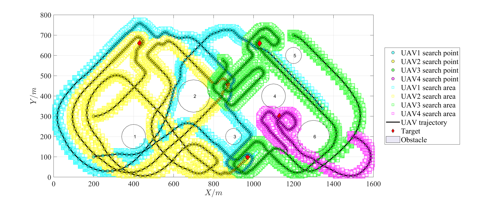
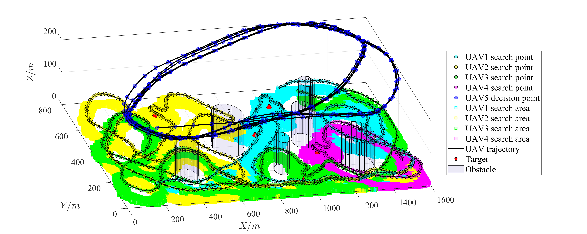

# UAV_Cooperative_Search

This repository provides a homogeneous/heterogeneous unmanned aerial vehicles (UAVs) cooperative search program that runs in MATLAB.

Please cite our paper if you use this project in your research:

* Heterogeneous Unmanned Aerial Vehicles Cooperative Search Approach for Complex Environments, Zhenchang Liu, Mingrui Hao

# Quick Start

This project was developed in MATLAB 2023a. This program does not use a particular toolbox and can be used in lower versions of MATLAB. The program usage steps are as follows:

1. First, clone this repository.

   ```
   git clone https://github.com/LiuZhenchang/UAV_Cooperative_Search.git
   ```

2. Open the UAV_Cooperative_Search folder in MATLAB.

3. Open the file “run_demo.m”, set demo_index=1, and run the script. The program updates the search results in the figure every ten search decisions. Finally, you will see the search results of 4 homogenous UAVs with stationary obstacles. The search results may be different each time the program is run.

   <p align="center">
     
   </p>


4. Open the file “run_demo.m”, set demo_index=2, and run the script. You will see the search results of 5 heterogeneous UAVs with stationary obstacles. In the UAV trajectories figure, you can use the Tools of Rotate 3D to adjust the angle of view.

   <p align="center">
     
   </p>

5. Open the file "run_demo.m", set demo_index=3, and run the script. You will see the search results of 5 heterogeneous UAVs with dynamic obstacles. After the program is complete, run the following program, which can generate a video of UAVs' cooperative search process.

   ```
   F=Plot_UAV_Trajectory_Dynamic(map,GS,UAV_Coordinate,TAR,OBS);
   h=figure;
   set(gcf,'unit','inches','position',[0,0,14,6]);
   movie(h,F,1,10);
   v=VideoWriter('Trajectory.mp4','MPEG-4');
   v.FrameRate=10;
   v.Quality=100;
   open(v);
   writeVideo(v,F);
   close(v);
   ```

   <p align="center">
     
   </p>

# Licence
The source code is released under [GPLv3](http://www.gnu.org/licenses/) license.
